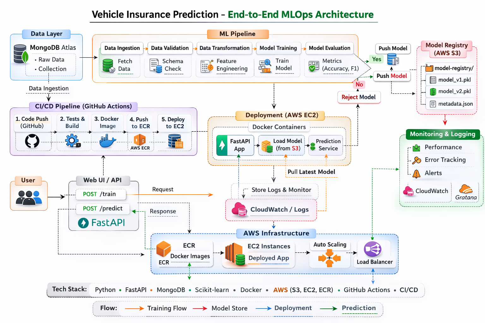

## 🚗 Vehicle Insurance Prediction – End-to-End MLOps Project

An end-to-end production-style Machine Learning project that predicts vehicle insurance outcomes using a modular MLOps architecture.

This project covers the full ML lifecycle:
Data Ingestion → Validation → Transformation → Model Training → Evaluation → Model Registry → Deployment → CI/CD.


</img>


## 📌 Project Highlights

- Modular and scalable ML pipeline architecture
- MongoDB Atlas as cloud data source
- Schema-based data validation
- AWS S3 model registry
- Dockerized application
- CI/CD using GitHub Actions
- Deployed on AWS EC2
- FastAPI-based training and prediction endpoints


## Project Architecture

```
└── 📁Vehicle_Insurance
    └── 📁.github
        └── 📁workflows
            ├── aws.yaml
    └── 📁artifact
        
    └── 📁config
        ├── model.yaml
        ├── schema.yaml
    └── 📁logs
        
    └── 📁notebook
        ├── cleaning.ipynb
        ├── data.csv
        ├── eda.ipynb
        ├── exp_notebook.ipynb
        ├── mongodb.ipynb
    └── 📁src
        └── 📁cloud_storage
            ├── __init__.py
            ├── aws_storage.py
        └── 📁components
            ├── __init__.py
            ├── data_ingestion.py
            ├── data_transformation.py
            ├── data_validation.py
            ├── model_evaluation.py
            ├── model_pusher.py
            ├── model_trainer.py
        └── 📁configuration
            ├── __init__.py
            ├── aws_connection.py
            ├── mongodb_connection.py
        └── 📁constants
            ├── __init__.py
        └── 📁data_access
            ├── __init__.py
            ├── vehical_data.py
        └── 📁entity
            ├── __init__.py
            ├── artifact_entity.py
            ├── config_entity.py
            ├── estimator.py
            ├── s3_estimator.py
        └── 📁exception
            ├── __init__.py
        └── 📁logger
            ├── __init__.py
        └── 📁pipeline
            ├── __init__.py
            ├── prediction_pipeline.py
            ├── training_pipeline.py
        └── 📁utils
            ├── __init__.py
            ├── main_utils.py
        ├── __init__.py
    
    └── 📁static
        └── 📁css
            ├── style.css
    └── 📁templates
        ├── vehicledata.html
    ├── .dockerignore
    ├── .env
    ├── .gitignore
    ├── app.py
    ├── demo.py
    ├── Dockerfile
    ├── LICENSE
    ├── mongo.py
    ├── pyproject.toml
    ├── README.md
    ├── requirements.txt
    ├── setup.py
    ├── template.py
    └── workflow.txt
```

### Tech Stack 
```
Languages & Libraries

- Python
- Pandas
- NumPy
- Scikit-learn
- FastAPI

Database

- MongoDB Atlas

Cloud

- AWS S3
- AWS EC2
- AWS ECR
- AWS IAM

DevOps

- Docker
- GitHub Actions
- CI/CD
```

### Deployed On AWS 

<video src="deploy_video.mp4" width="600" controls>
  Your browser does not support the video tag.
</video>